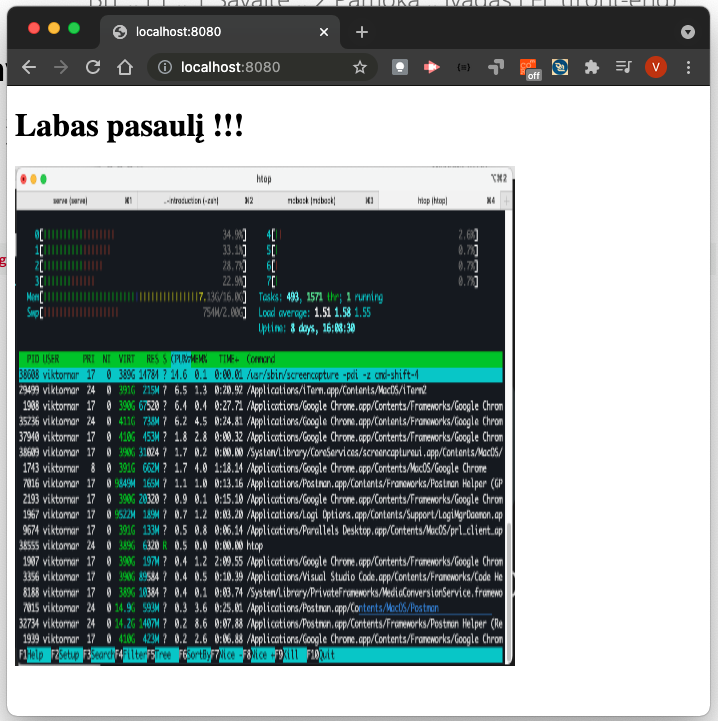

# Paveiksliukai

* žyma (ang. tag) `` yra savaime užsidaranti žyma (ang. tag), leidžianti pridėti vaizdus mūsų tinklalapyje. Jis gali turėti keletą atributų:
  * src - santykinė nuoroda į vaizdą, kuris turėtų būti rodomas,
  * alt - vaizdo aprašymas, ○ plotis,
  * height = aukštis.

```html

```
---

